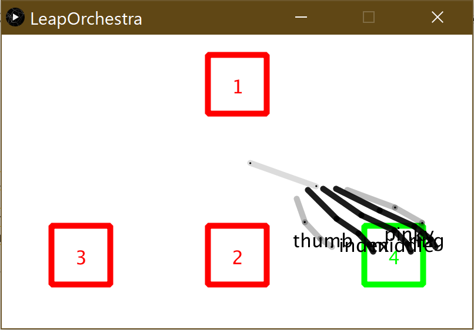
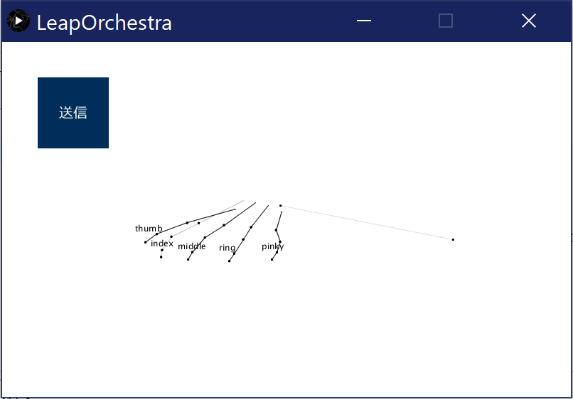
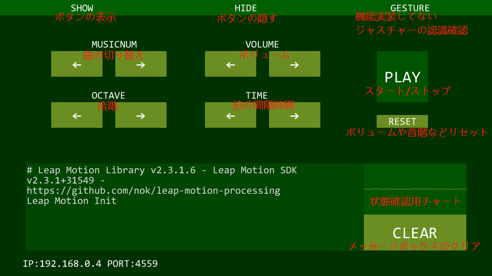
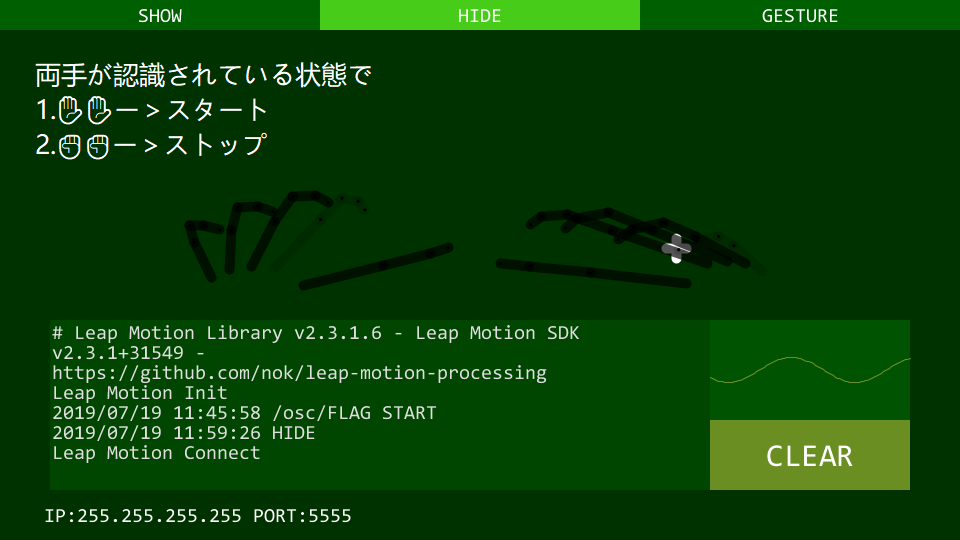

# LeapOtchestra
:shipit:Leap Motionを用いたジェスチャ操作による、拍数情報をraspberry piに送る。
## 目次
1. [環境構築](#環境構築)  
    1. [Leap Motion](#leapmotion)  
    2. [~~Unity~~](#unity)  
    3. [Processing](#processing)
    4. [SonicPi](#SonicPi)
2. [更新履歴](#更新履歴)  
    1. [2019.06.14](#20190614)  
    2. [2019.06.18](#20190618)  
    3. [2019.06.21](#20190621)  
    4. [2019.06.25](#20190625)
    5. [2019.07.19](#20190719)
## 環境構築
### LeapMotion
* [Leap_Motion_Developer_Kitのダウンロード（Leap_Motion_Setup.exe）](https://developer.leapmotion.com/get-started)
* [Leap Motion SDKのダウンロード（Leap_Motion_Developer_Kit.zip）](https://developer.leapmotion.com/get-started)
### ~~Unity~~
* [~~Unityのダウンロード~~](https://store.unity.com/ja?_ga=2.109239045.1635307830.1561082608-1793881246.1537953195&currency=JPY)
* [~~Unity Assets for Leap Motion Orion Betaのダウンロード（Leap_Motion_Core_Assets.unitypackage）~~](https://developer.leapmotion.com/unity#5436356)
### Processing
* [Processingのダウンロード](https://processing.org/download/)
* Leap Motion for Processingライブラリのインポート
* [Leap Javaライブラリのインポート](https://developer-archive.leapmotion.com/documentation/java/devguide/Leap_Processing.html)
* [UDPライブラリのインポート](https://memorandums.hatenablog.com/entry/2016/11/08/203610)(2019.06.21追加)
### SonicPi
* [SonicPiのダウンロード](https://sonic-pi.net/)
## 更新履歴
### 2019.06.14
1. 四つの矩形の設置、およびあたり判定  

### 2019.06.18
1. グー、チョキ、パー　ジャスチャーの検出
2. 指で抓む　ジャスチャーの検出
3. 手の位置を取って図を描く  
 [LeapDrawの確認プログラムへ](https://github.com/SkyoKen/LeapDraw/tree/master/exe)
4. ~~Processingでの通信テスト~~   [~~（Processing で通信するプログラムを作るへ）~~](https://github.com/SkyoKen/NetTerminal/tree/master/Net)  
    ~~自身のPCの通信　確認済~~  
    ~~他のPCとの通信　未確認~~
### 2019.06.20
~~1. バイナリファイルからデータの書き込みと読み込み~~
### 2019.06.21
1. UDP通信機能の追加  
[UDP通信の確認プログラムへ](https://github.com/SkyoKen/NetTerminal//tree/master/UDP)  

2. Leap Motionを用いたジェスチャ操作によるピアノを弾くプログラムの作成  
[LeapPianoの確認プログラムへ](https://github.com/SkyoKen/LeapPiano/tree/master/exe)
### 2019.06.25
1. データを送る時間を一秒ごとに変更
2. 手の移動量の検出
### 2019.07.19
1. Sonic Piを利用した音楽の出力(musicPlay.rb)
2. PCからRaspberry PiのSonic Piをコントロール
3. ボタンなどアイテムの追加

4. 機能実装されてないジャスチャーの認識の分離

[Processing2SoicPi(leapMotion抜き)確認プログラムへ](https://github.com/SkyoKen/Processing2SonicPi)  
[Processing2SoicPi(leapMotion付き)確認プログラムへ](https://github.com/SkyoKen/Processing2SonicPi/tree/leapmotoin)  

[↑TOP](#目次)
